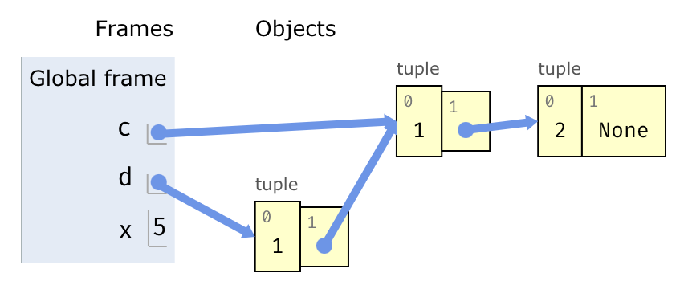

# Python Tutor: A Bluefish Case Study

## Introduction

In this section, we will explore how to use Bluefish to build complex domain specific diagrams like Python Tutor visualizations.

First, let's breakdown the parts of a Python Tutor visualization. Below is an example of a Python Tutor diagram that we will recreate in this section:



We can divide the components of this diagram into two groups: the components associated with the Global Frame and the Objects. Let's build these two parts of the diagram separately, and then compose the two parts to create the entire Python Tutor visualization.

## The Global Frame

The Global Frame itself is a composition of various other components. In particular, the Global Frame contains some text components, some variables, and some components responsible for the styling if the output.

### The Variable Sub-Component

First, let's construct a component for the variable label and value pairs at the right edge of the global frame. We will call this component `Variable`. The `Variable` component requires four pieces of information: the pointer of the object it references (which could be null), the variable name, the variable value, and the variable ID.

```tsx live noInline
const Variable = forwardRef(function _Variable({ data }, ref) {
  const { pointObject, name, value, opId } = data;

  // References
  const textRef = useRef(null);
  const valueRef = useRef(null);
  const boxRef = useRef(null);
  const boxRefBorderLeft = useRef(null);
  const boxRefBorderBottom = useRef(null);
  const variableRef = useRef(null);

  // Declares font used in Python Tutor Diagrams
  const fontFamily = 'verdana, arial, helvetica, sans-serif';

  return (
    <Group ref={ref} name={opId}>
    
        // Creates frame of Variable component (text label & box for value)
        <Space name={variableRef} horizontally by={5}>
            <Text ref={textRef} contents={name} fontSize={'24px'} fontFamily={fontFamily} fill={'black'} />
            <Rect ref={boxRef} height={40} width={40} fill={'#e2ebf6'} />
        </Space>

        // Creates left and bottom edge borders
        <Rect ref={boxRefBorderLeft} height={40} width={2} fill={'#a6b3b6'} />
        <Rect ref={boxRefBorderBottom} height={2} width={40} fill={'#a6b3b6'} />

        // Creates text labels of variable
        <Text
            ref={valueRef}
            contents={value}
            fontFamily={fontFamily}
            fontSize={'24px'}
            fill={'black'}
        />

        // Align text and border components to variable frame
        <Align bottomCenter>
            <Ref to={boxRefBorderBottom} />
            <Ref to={boxRef} />
        </Align>
        <Align centerLeft>
            <Ref to={boxRefBorderLeft} />
            <Ref to={boxRef} />
        </Align>
        <Align topCenter>
            <Ref to={valueRef} />
            <Ref to={boxRef} />
        </Align>
    </Group>
  )
})

render(
    <SVG width={300} height={50}>
        <Variable data={{ pointObject: null, name: 'x', value: '5', opId: 'v3' }} />
    </SVG>
)
```

### Constructing the Global Frame

Now, we are ready to put together the global frame component. The Bluefish component takes a list of Variables as input and generates the global frame with the appropriate text, styling, and variable label and value components.

```tsx live noInline
const GlobalFrame = forwardRef(function _GlobalFrame({ variables, opId }, ref) {
  // References
  const frame = useRef(null);
  const opIdLabel = useRef(null);
  const frameVariables = useRef(null);
  const frameBorder = useRef(null);

  // Font declaration
  const fontFamily = 'Andale mono, monospace';

  return (
    <Group ref={ref} name={opId}>
      {/* Global Frame and relevant text */}
      <Rect ref={frame} height={300} width={200} fill={'#e2ebf6'} />
      <Rect ref={frameBorder} height={300} width={5} fill={'#a6b3b6'} />
      <Text ref={opIdLabel} contents={'Global Frame'} fontSize={'24px'} fontFamily={fontFamily} fill={'black'} />
      <Align topCenter>
        <Ref to={opIdLabel} />
        <Ref to={frame} />
      </Align>
      {/* TODO: this Space and Align should be a Col, but Col overwrites *all* placeable positions
            even though opIdLabel has already been placed */}
      <Space vertically by={50}>
        <Ref to={opIdLabel} />
        <Col name={`frameVariables`} ref={frameVariables} spacing={20} alignment={'right'}>
          {variables.map((variable) => (
            <Variable data={variable} />
          ))}
        </Col>
      </Space>
      <Align right>
        <Ref to={frameVariables} />
        <Ref to={opIdLabel} />
      </Align>
      <Align centerLeft>
        <Ref to={frameBorder} />
        <Ref to={frame} />
      </Align>
    </Group>
  );
});

render(
    // Try adding more data or changing the data here!
    <SVG width={500} height={300}>
        <GlobalFrame
            variables={[
            { pointObject: { opId: 'list1' }, name: 'c', value: null, opId: 'cID' },
            { pointObject: { opId: 'list2' }, name: 'd', value: null, opId: 'dID' },
            { pointObject: { opId: 'list3' }, name: 'x', value: '5', opId: 'xID' },
            ]}
            opId={'globalFrame'}
      />
    </SVG>
)

```
And with that, our global frame is complete! Let's now create the other part of our Python Tutor diagram: the objects that our global frame variables reference.

## The Objects

In the Python Tutor diagram, the objects that the global frame variables reference are represented as rectangles with a value and pointer to the next object in the sequence. First, let's create a subcomponent to represent the objects.

```tsx live noInline
const Objects = forwardRef(function _Objects({nextObject, objectType, value, opId}, ref) {
  const itemRef = useRef(null);
  const boxRef = useRef(null);
  const valueRef = useRef(null);
  const labelRef = useRef(null);
  const zeroRef = useRef(null);
  const oneRef = useRef(null);
  const elemRef = useRef(null);

  const fontFamily = 'verdana, arial, helvetica, sans-serif';

  return (
    <Group ref={ref} name={opId}>
      <Text ref={labelRef} contents={objectType} fontFamily={fontFamily} fontSize={'16px'} fill={'grey'} />

      {/* separate names for each rectangle so that the arrow can go from the center of pointer to the center left of pointed */}
      <Group ref={elemRef}>
        <Rect ref={boxRef} name={`pointer${opId}`} height={60} width={70} fill={'#ffffc6'} stroke={'grey'} />
        <Rect ref={itemRef} name={`pointed${opId}`} height={60} width={70} fill={'#ffffc6'} stroke={'grey'} />
        <Text ref={valueRef} contents={value} fontSize={'24px'} fill={'black'} />
        <Text ref={zeroRef} contents={'0'} fontFamily={fontFamily} fontSize={'16px'} fill={'grey'} />
        <Text ref={oneRef} contents={'1'} fontFamily={fontFamily} fontSize={'16px'} fill={'grey'} />

        <Align center>
          <Ref to={valueRef} />
          <Ref to={itemRef} />
        </Align>

        <Align left to={'centerRight'}>
          <Ref to={boxRef} />
          <Ref to={itemRef} />
        </Align>

        <Align topLeft>
          <Ref to={oneRef} />
          <Ref to={boxRef} />
        </Align>
      </Group>

      <Space vertically by={10}>
        <Ref to={labelRef} />
        <Ref to={elemRef} />
      </Space>
    </Group>
  );
});

render(
    <SVG width={500} height={100}>
      <Objects nextObject={{ opId: 'object2' }} objectType={'tuple'} value={'1'} opId={'object1'} />
    </SVG>
)
```

We can imagine that the objects are located in a grid, and we can specify the contents of each grid with a series of ``Row`` components. Therefore, our set of Objects is essentially a matrix.

```tsx live noInline
const ObjectsMatrix = forwardRef(function _ObjectsMatrix({objects, rows}, ref) {

  // lookup map for the yellow objects
  const objMap = new Map();
  objects.forEach((obj) => objMap.set(obj.opId, obj));

  return (
    <Group ref={ref} name={'matrix-rows'}>

      <Space name={'rowSpace'} vertically by={50}>
        {rows.map((level, index) => (
          <Row name={`row${index}`} spacing={50} alignment={'middle'}>
            {level.nodes.map((obj) => (obj == '' ? <Rect name={'filler'} height={60} width={160} fill={'none'} stroke={'none'} /> : <Objects {...objMap.get(obj)} />))}
          </Row>
        ))}
      </Space>
    </Group>
  )
});

render(
  // Try changing the objects or the arrangement of the matrix!
  <SVG width={700} height={300}>
      <ObjectsMatrix objects={[
          { nextObject: { opId: 'o2' }, objectType: 'tuple', value: '1', opId: 'o1' },
          { nextObject: { opId: 'o3' }, objectType: 'tuple', value: '2', opId: 'o2' },
          { nextObject: null, objectType: 'tuple', value: '3', opId: 'o3' },
        ]}
        rows={[
          { depth: 0, nodes: ['', 'o2', 'o3'] },
          { depth: 1, nodes: ['o1', '', ''] },
        ]} />
  </SVG>
)

```

## Putting The Diagram Together

Now that we've created the two halves of our Python Tutor diagram, let's compose them together and add links between the global frame variables and the objects to complete our visualization!

```tsx live noInline
const PythonTutor = forwardRef(function _PythonTutor({variables, objects, rows, opId}, ref) {

  const globalFrame = useRef(null);
  const rowRef = useRef(null);

  // lookup map for the yellow objects
  const objMap = new Map();
  objects.forEach((obj) => objMap.set(obj.opId, obj));

  // find start and end location for links between objects and objects
  const objectLinks = objects
    .filter((object) => object.nextObject !== null)
    .map((object, index) => {
      return {
        opId: `objectLink${index}`,
        start: { opId: `pointer${object.opId}` },
        end: { opId: `pointed${object.nextObject.opId}` },
      };
    });
  
  // find start and end locations for links between global frame and objects
  const variableLinks = variables
    .filter((variable) => variable.pointObject !== null)
    .map((variable, index) => {
      return {
        opId: `variableLink${index}`,
        start: { opId: variable.opId },
        end: { opId: `pointed${variable.pointObject.opId}` },
      };
    });

  return (
    <Group ref={ref} name={opId}>
      <GlobalFrame variables={variables} opId={'globalFrame'} ref={globalFrame} />
      
      <Group ref={rowRef} name={'rows'}>
        <Space name={'rowSpace'} vertically by={50}>
          {rows.map((level, index) => (
            <Row name={`row${index}`} spacing={30} alignment={'middle'}>
              {level.nodes.map((obj) => (obj == '' ? <Rect name={'filler'} height={60} width={160} fill={'none'} stroke={'none'} /> : <Objects {...objMap.get(obj)} />))}
            </Row>
          ))}
        </Space>
      </Group>

      
      <Space name={'space1'} horizontally by={60}>
        <Ref to={globalFrame} />
        <Ref to={rowRef} />
      </Space>

      <Space name={'space2'} vertically by={-250}>
        <Ref to={globalFrame} />
        <Ref to={rowRef} />
      </Space>

      {objectLinks.map((link) => (
        <Group>
          <Link {...link} />
        </Group>
      ))}
      
       {variableLinks.map((link) => (
        <Group>
          <Link {...link} />
        </Group>
      ))}
    </Group>

  )
});

render(
  // Try changing the objects or the arrangement of the matrix!
  <SVG width={800} height={400}>
      <PythonTutor
        variables={[
          { pointObject: { opId: 'o1' }, value: '', name: 'c', opId: 'v1' },
          { pointObject: { opId: 'o2' }, value: '', name: 'd', opId: 'v2' },
          { pointObject: null, name: 'x', value: '5', opId: 'v3' },
        ]}
        opId={'pythonTutorFrame'}
        objects={[
          { nextObject: { opId: 'o2' }, objectType: 'tuple', value: '1', opId: 'o1' },
          { nextObject: { opId: 'o3' }, objectType: 'tuple', value: '2', opId: 'o2' },
          { nextObject: null, objectType: 'tuple', value: '3', opId: 'o3' },
        ]}
        rows={[
          { depth: 0, nodes: ['', 'o2', 'o3'] },
          { depth: 1, nodes: ['o1', '', ''] },
        ]}
      />
  </SVG>
)

```

## Generalizing Python Tutor

Python Tutor diagrams are very flexible, and the content represented in the diagram can be very diverse. For example, objects could have arbitrary length. Objects themselves could simply store pointers to other primitive types. In the following sections, we will explore how to generalize the Bluefish Python Tutor diagram to flexibility handle these situations.

### Redefining the Object Type

First, let's modify our tuple Objects. We see that there are two cases we should consider: when the tuple is a pointer to another object, or when the tuple contains a value.

```tsx live noInline
const ObjectsV2 = forwardRef(function _Objects({objectType, objectValues, objectId}, ref) {
  // objectValues: list with two entries; first entry is type of first box, second entry is type of second box

  const objectTypeRef = useRef(null);
  const objectRef = useRef(null);

  const boxZeroRef = useRef(null);
  const boxOneRef = useRef(null);
  const boxZeroValueRef = useRef(null);
  const boxOneValueRef = useRef(null);
  const zeroRef = useRef(null);
  const oneRef = useRef(null);

  const fontFamily = 'verdana, arial, helvetica, sans-serif';

  return (
    <Group ref={ref} name={objectId}>
      <Text ref={objectTypeRef} contents={objectType} fontFamily={fontFamily} fontSize={'16px'} fill={'grey'} />

      {/* separate names for each rectangle so that the arrow can go from the center of pointer to the center left of pointed */}
      <Group ref={objectRef}>
        <Rect ref={boxZeroRef} name={`pointer${objectId}`} height={60} width={70} fill={'#ffffc6'} stroke={'grey'} />
        <Rect ref={boxOneRef} name={`pointed${objectId}`} height={60} width={70} fill={'#ffffc6'} stroke={'grey'} />

        {/* Generate Text in Object based on whether it is a string or a pointer */}
        {(objectValues[0].type == 'string') ? <Text ref={boxZeroValueRef} contents={objectValues[0].value} fontSize={'24px'} fill={'black'} /> : <Text ref={boxZeroValueRef} contents={''} fill={'none'} />}

        {(objectValues[1].type == 'string') ? <Text ref={boxOneValueRef} contents={objectValues[1].value} fontSize={'24px'} fill={'black'} /> : <Text ref={boxOneValueRef} contents={''} fill={'none'} />}

        {/* Labels in top left corner*/}
        <Text ref={zeroRef} contents={'0'} fontFamily={fontFamily} fontSize={'16px'} fill={'grey'} />
        <Text ref={oneRef} contents={'1'} fontFamily={fontFamily} fontSize={'16px'} fill={'grey'} />

        <Align center>
          <Ref to={boxZeroValueRef} />
          <Ref to={boxZeroRef} />
        </Align>

        <Align left to={'centerRight'}>
          <Ref to={boxOneRef} />
          <Ref to={boxZeroRef} />
        </Align>

        <Align center>
          <Ref to={boxOneValueRef} />
          <Ref to={boxOneRef} />
        </Align>

        <Align topLeft>
          <Ref to={oneRef} />
          <Ref to={boxOneRef} />
        </Align>
      </Group>

      <Space vertically by={10}>
        <Ref to={objectTypeRef} />
        <Ref to={objectRef} />
      </Space>
    </Group>
  );

});
render(
  <SVG width={500} height={100}>
      <ObjectsV2 
          objectType={'tuple'} 
          objectValues={[
            {type: 'string', value: '1'}, 
            {type: 'string', value: '2'}]} 
          objectId={'object1'} />
    </SVG>
)
```

Now let's build Python Tutor again with our updated Object type!

```tsx live noInline

render(
  <SVG width={500} height={100}>
      <ObjectsV2 
          objectType={'tuple'} 
          objectValues={[
            {type: 'string', value: '1'}, 
            {type: 'string', value: '2'}]} 
          objectId={'object1'} />
    </SVG>
)


```

