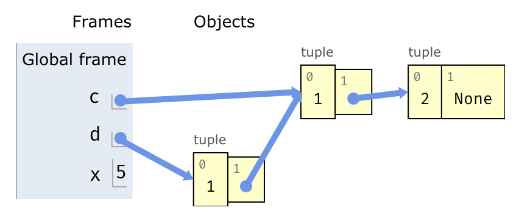

# Python Tutor: A Bluefish Case Study

In this section, we will explore how to use Bluefish to build complex domain specific diagrams like Python Tutor visualizations.

First, let's breakdown the parts of a Python Tutor visualization. Below is an example of a Python Tutor diagram that we will recreate in this section:

We can divide the components of this diagram into two groups: the components associated with the Global Frame and the Objects. Let's build these two parts of the diagram separately, and then compose the two parts to create the entire Python Tutor visualization.